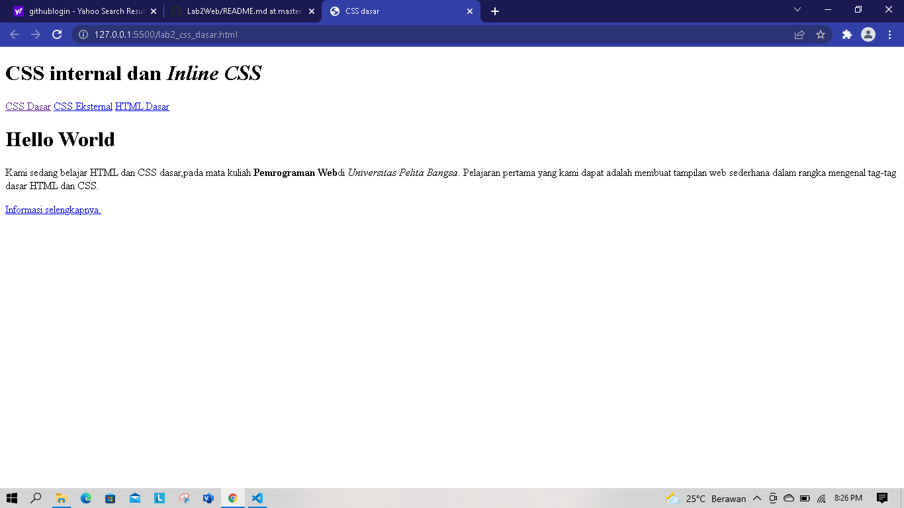
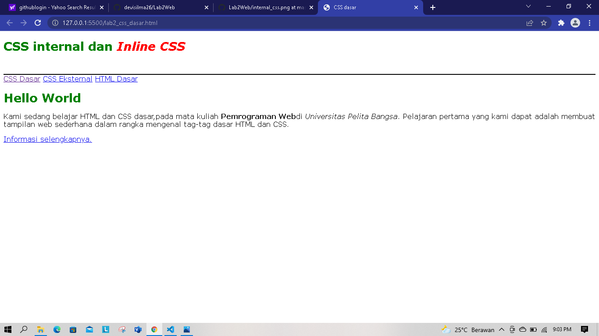
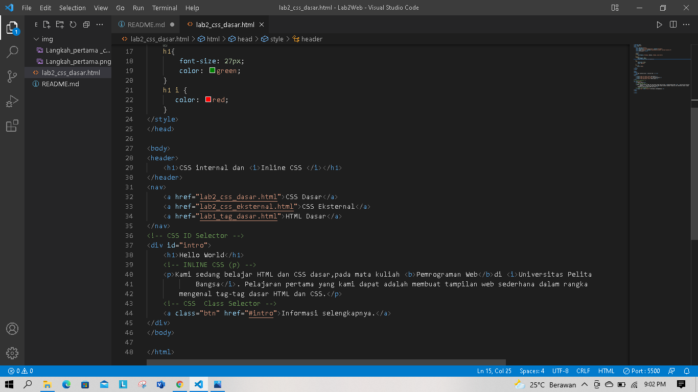
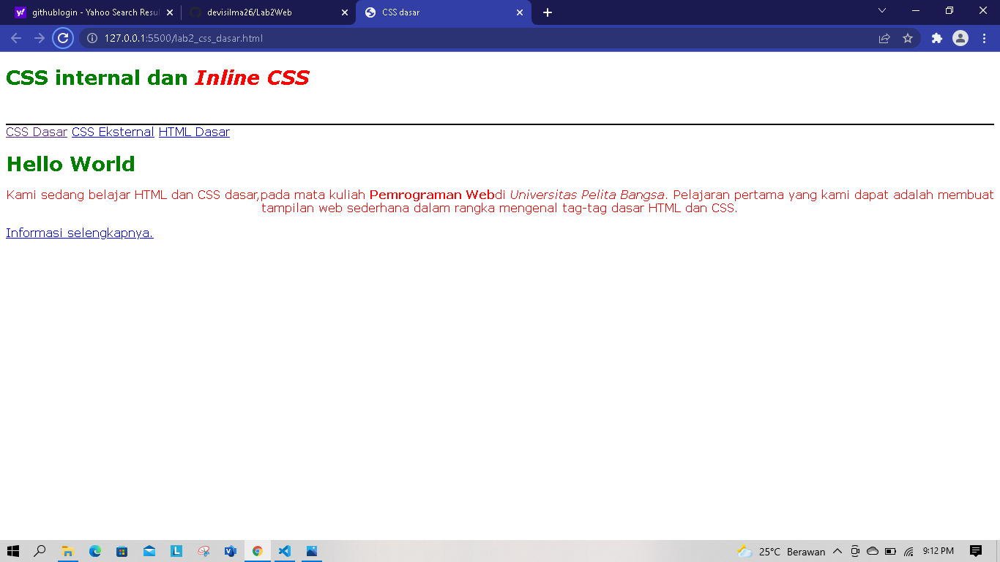
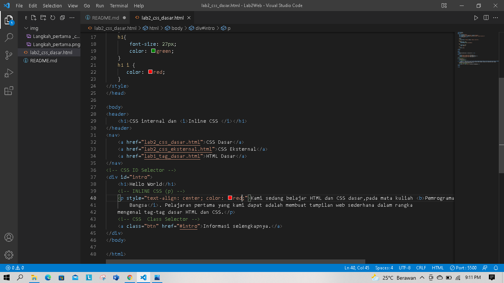
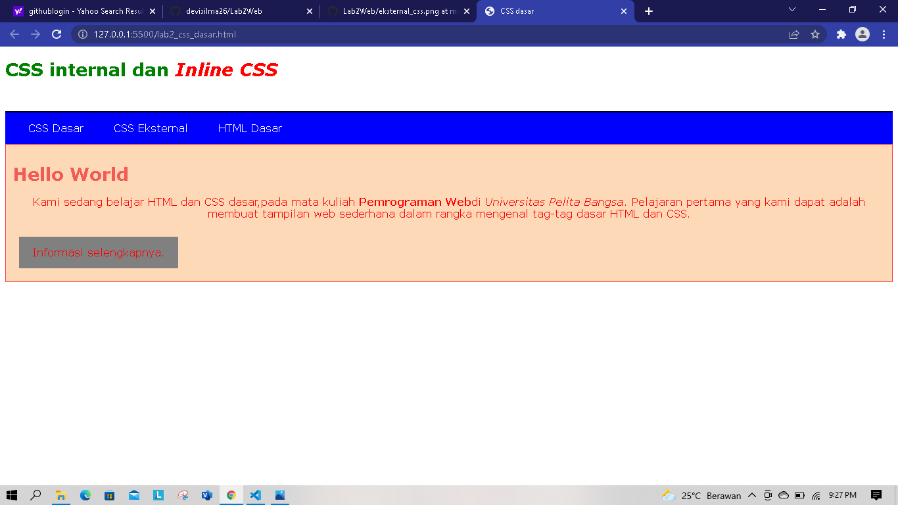
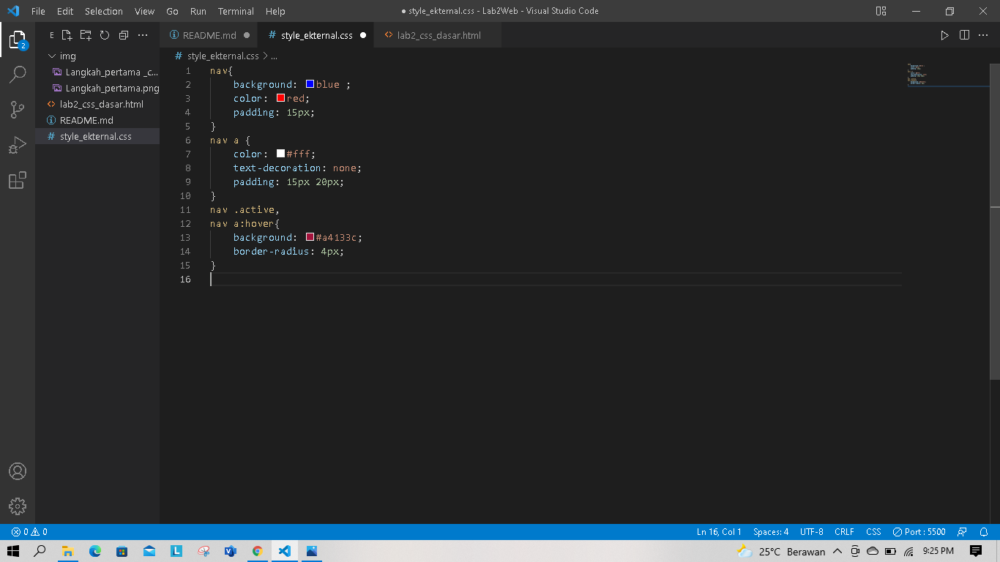

# Lab2web

1.) langkah pertama buat dokumen HTML

contoh code dan hasilnya




disini adalah contoh terdapat file dokumen html dasar yang belum di beri css dasar inline eksternal

```html
<!DOCTYPE html>
<html lang="en">
<head>
    <meta charset="UTF-8">
    <meta http-equiv="X-UA-Compatible" content="IE=edge">
    <meta name="viewport" content="width=device-width, initial-scale=1.0">
    <title>CSS dasar</title>
</head>

<body>
<header>
    <h1>CSS internal dan <i>Inline CSS </i></h1>
</header>
<nav>
    <a href="lab2_css_dasar.html">CSS Dasar</a>
    <a href="lab2_css_eksternal.html">CSS Eksternal</a>
    <a href="lab1_tag_dasar.html">HTML Dasar</a>
</nav>
<div id="intro">
    <h1>Hello World</h1>
    <p>Kami sedang belajar HTML dan CSS dasar,pada mata kuliah <b>Pemrograman Web</b>di <i>Universitas Pelita
    Bangsa</i>. Pelajaran pertama yang kami dapat adalah membuat tampilan web sederhana dalam rangka
    mengenal tag-tag dasar HTML dan CSS.</p>
    <a class="btn" href="#intro">Informasi selengkapnya.</a>
</div>
</body>

</html>
```

2.) mendeklarasikan css internal

contoh code dan hasilnya





ini adalah contoh bagaimana meletakan inline dalam css dan juga code code dalam cssnya seperti color pada h1

```html
    <title>CSS dasar</title>
   <link rel="stylesheet" href="style_ekternal.css">
   <style>  
    body{
        font-family: Verdana, Geneva, Tahoma, sans-serif;
    }
    header{
        min-height: 80px;
        border-bottom: 2px solid black;
    }
    h1{
        font-size: 27px;
        color: green;
    }
    h1 i {
       color: red; 
    }
</style>
</head>
```

3.) MENAMBAHKAN INLINE CSS

contoh code dan hasilnya





ini adalah contoh CSS inline, CSS inline adalah prioritas dalam pendeklarasian jika di deklarasikan secara bersamaan inline prioritas

```html
    <p style="text-align: center; color: red;">Kami sedang belajar HTML dan CSS dasar,pada mata kuliah <b>Pemrograman Web</b>di <i>Universitas Pelita
    Bangsa</i>. Pelajaran pertama yang kami dapat adalah membuat tampilan web sederhana dalam rangka
    mengenal tag-tag dasar HTML dan CSS.</p>
```

4.) MEMBUAT CSS EKTERNAL

contoh dan hasilnya





CSS ekternal adalah css yang di mana filenya terpisah dengan html itu sendiri dengan melalui link penempatan CSS, CSS ekternal mampu di gunakan banyak file html itu lah keunggulan dari CSS ekternal

```css
nav{
    background: blue ; 
    color: red;
    padding: 15px;
}
nav a {
    color: #fff;
    text-decoration: none;
    padding: 15px 20px;
}
nav .active,
nav a:hover{
    background: #a4133c;
    border-radius: 4px;
}
```

5.) MENAMBAHKAN CSS SELEKTOR


css selektor dapat berupa elemen HTML, selektor class atau selektor id. penggunaan selektor di sesuaikan dengan kebutuhannya

```css
/* ID SELECTOR */
#intro{
    background: #fed9b7;
    border: 1px solid #f94144;
    min-height: 100px;
    padding: 10px;
}
#intro h1{
    text-align: left;
    border: 0;
    color: #f25c54;
}
/* class selector */
.btn{

    padding: 15px 20px;
    background: gainsboro;
    color: red;
    display: inline-block;
    margin: 10px;
    text-decoration: none;
}
.btn-primary{
    background: blue;
    
}
```

# Ini jawaban Soal Pertanyaan
1. Di sini, saya melakukan perubahan pada bagian button di CSS dengan menambahkan property {border-radius: 10px;} dan teks judul Hello World dengan merubah font-family -nya menjadi font-family: 'League Gothic', sans-serif; dengan font @import url('https://fonts.googleapis.com/css2?family=League+Gothic&display=swap'); dari Google Fonts dan memaksa semua hurufnya menjadi kapital dengan text-transform: uppercase;.
2. perbedaannya jika hanya h1(..) maka akan berubah semuanya yang ada di elemen h1(..) sedangkan #intro h1(..) hanya akan merubah yang memiliki tag intro.
3. Ketika kita mendeklarasikan secara bersamaan antara INTERNAL, EKSTERNAL dan INLINE, yang akan ditampilkan pada Browser adalah INLINE. Karena INLINE Memiliki deklarasi prioritas dibanding EKSTERNAL atau pun INTERNAL, seperti contoh yang saya buat, saya membuat dokumen baru HTML kemudian saya buat Elemen {h1} yang kemudian saya akan deklarasikan di CSS INTERNAL, EKSTERNAL dan juga INLINE Dengan property {color} yang berbeda, jika INTERNAL {color: red}, sementara EKSTERNAL {color:green;} dan INLINE {color: blue;}. Maka yang terpanggil di browser adalah INLINE karena memiliki prioritas. 